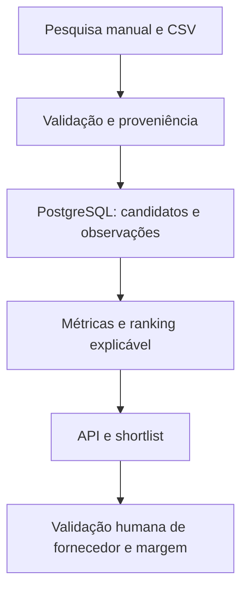

# Product Intelligence — arquitetura inicial

**Status:** proposta para implementação incremental  
**Data:** 26/09/2026  
**Mercado-alvo:** Estados Unidos (análise em inglês, preços em USD)  
**Infraestrutura inicial:** uma VM no Brasil

## 1. Objetivo

Criar um sistema pessoal para registrar candidatos a produto encontrados no TikTok e em outras fontes, acompanhar evidências ao longo do tempo e decidir quais merecem pesquisa de fornecedor e eventual teste numa loja Shopify voltada aos EUA.

O sistema **organiza hipóteses**, não declara que um produto é vencedor. Visualizações, engajamento e presença em anúncios são sinais indiretos; vendas, margem real e custo de aquisição precisam de validação separada.

### Perguntas que o sistema deve responder

1. Quais produtos foram encontrados e em quais links/fontes?
2. Que evidência observável indica interesse no mercado americano? Qual a origem e a data dessa evidência?
3. O interesse cresceu entre observações **comparáveis** ou só há um vídeo popular?
4. Quais custos e riscos ainda faltam verificar antes de testar a venda?
5. Por que cada candidato está no topo da lista e quão incompletos são seus dados?

## 2. Decisões de escopo

| Tema | Decisão inicial |
|---|---|
| Entrada de dados | Formulário/API para registro manual e importação CSV com esquema documentado. |
| TikTok | Pesquisa humana em Creative Center/Top Ads/Top Products e links públicos; guardar apenas informações registradas ou obtidas por canal autorizado. |
| Automação de fonte | Conector isolado e **desligado por padrão**; habilitar somente após verificar acesso, permissão de uso, campos, estabilidade e limites. |
| Região | Cada evidência recebe `market_region` e `region_basis`; idioma inglês ou IP brasileiro/americano, por si só, não provam audiência nos EUA. |
| Banco | PostgreSQL com migrações Alembic; SQLite pode aparecer apenas em testes locais. |
| Backend | Python, FastAPI, SQLAlchemy, Pydantic e tarefas CLI agendáveis. |
| Interface | API primeiro; dashboard básico após existir histórico útil. |
| IA/NLP | Posterior; somente com dados a que tenhamos acesso apropriado e rótulos auditáveis. |
| Shopify | Sem integração na V1; apenas exportação de shortlist para avaliação humana. |

**Fora da V1:** scraping do feed For You, comentários em massa, contorno de CAPTCHA/bloqueios, proxies para burlar restrições, download de vídeos, dedução de vendas a partir de views, publicação automática de produtos, descoberta automática de fornecedores e conta TikTok Shop. A Research API do TikTok é voltada a pesquisa elegível de interesse público/não comercial; a Commercial Content API documenta cobertura regional que não resolve diretamente este caso de anúncios nos EUA. Essas restrições devem ser reavaliadas antes de qualquer conector novo [1–4].

## 3. Fluxo de dados



Uma evidência é sempre separada da avaliação que fazemos dela. O caminho é `fonte → registro bruto/atributos permitidos → validação → observação datada → métricas derivadas → decisão humana`. Importações repetidas precisam ser idempotentes. Mudanças em uma regra de score podem recalcular rankings sem apagar as observações originais.

## 4. Modelo de dados mínimo

| Entidade | Campos essenciais | Regra |
|---|---|---|
| `product_candidate` | `id`, `name`, `category`, `description`, `status`, `created_at` | Um conceito de produto; nomes parecidos não são unidos automaticamente. |
| `source_item` | `id`, `source_type`, `external_url`, `external_id?`, `title?`, `creator_handle?`, `published_at?`, `created_at` | Um vídeo, anúncio, página de tendência ou link de fornecedor. URL canônica única por tipo quando possível. |
| `product_source` | `product_id`, `source_item_id`, `relation`, `reviewed_at?` | Associação muitos-para-muitos; permite revisão manual de falsos agrupamentos. |
| `observation` | `id`, `source_item_id`, `observed_at`, `market_region?`, `region_basis`, `views?`, `likes?`, `comments_count?`, `shares?`, `observed_price_usd?`, `capture_method`, `note?` | Snapshot imutável de **campos disponíveis**. `NULL` significa desconhecido, nunca zero. |
| `supplier_offer` | `id`, `product_id`, `supplier_url`, `unit_cost_usd?`, `shipping_usd?`, `delivery_days?`, `ships_from?`, `observed_at`, `verification_status` | Preço e prazo são cotações datadas, não garantias. |
| `review` | `id`, `product_id`, `decision`, `reason`, `reviewed_at` | Decisão humana: `watch`, `research_supplier`, `test`, `reject`. |
| `score_run` | `id`, `product_id`, `rule_version`, `computed_at`, `components_json`, `coverage`, `score?` | Guarda explicação e versão da fórmula; `score` pode ficar vazio. |

`source_type`: `tiktok_top_ads`, `tiktok_top_products`, `tiktok_video`, `other`, `supplier`. `capture_method`: `manual`, `csv`, `approved_api`. `region_basis`: `source_filter_us`, `declared_creator`, `language_only`, `unknown`, etc. Um filtro `United States` visível na fonte é evidência mais forte que idioma; ainda assim não é comprovação da localização de cada comprador.

**Índices iniciais:** `source_item(source_type, external_url)` único quando URL existe; `observation(source_item_id, observed_at)` único para evitar duplicatas de uma mesma coleta; índices em `product_candidate(status)` e `observation(observed_at)`. Preservar moeda original e taxa/data de conversão caso custos não sejam informados em USD; nunca rotular valor convertido como cotação USD original.

## 5. Importação e qualidade

Na V1, aceitar CSV UTF-8 com cabeçalho documentado. Exemplo mínimo:

```csv
product_name,source_type,source_url,observed_at,market_region,region_basis,views,likes,note
Pet hair remover,tiktok_top_ads,https://example.com/ad/123,2026-09-26T12:00:00Z,US,source_filter_us,120000,4300,Exemplo ficticio
```

O exemplo acima é **dado fictício** para documentar o formato, não uma observação real. Regras: normalizar URL sem remover identificadores necessários; validar enums, USD e datas UTC; rejeitar contagens negativas; registrar erros por linha; fazer `upsert` do item e evitar observações duplicadas; nunca substituir uma métrica ausente por zero; manter referência à linha/lote de importação para auditoria. Não armazenar comentários, perfis pessoais ou mídia na V1.

## 6. Métricas e avaliação

- **Crescimento:** comparar o *mesmo* `source_item` em duas ou mais observações de contadores cumulativos, com timestamps e intervalos suficientes. Registrar variação absoluta e por hora/dia; sinalizar queda de contador ou mudança da fonte como anomalia. Uma primeira observação não tem velocidade calculável.
- **Diversidade:** contar criadores distintos somente quando essa informação existir e os links tiverem sido associados ao mesmo produto. Ausência de creator não equivale a zero concorrentes.
- **Engajamento:** `likes / views` ou `comments_count / views` apenas quando os dois valores forem conhecidos, comparáveis e `views > 0`; um anúncio pode ter dinâmica diferente de conteúdo orgânico.
- **Cobertura americana:** mostrar separadamente quantos itens possuem filtro/região observados. Evitar misturar indicadores de mercados diferentes no score dos EUA.
- **Oferta:** contribuição estimada por pedido = `preço de venda − custo do produto − frete/fulfillment − taxa de pagamento − CAC estimado − provisão de devoluções/impostos aplicáveis`. Cada custo recebe origem e data; sem CAC observado, mostrar cenários, não lucro certo.

**V1:** ordenar por dados verificáveis (observações recentes, crescimento mensurável e variedade de fontes), exibir campos faltantes e marcar `insufficient_data` quando não houver séries comparáveis. **V2:** score ponderado configurável e versionado, inicialmente uma hipótese a calibrar com resultados dos próprios testes. Nunca exibir `buy_intent`, saturação ou vendas como métricas medidas sem fonte e método explícitos. O ranking não deve premiar automaticamente dados ausentes.

## 7. Componentes e operação na VM brasileira

```text
product-intelligence/
├── ARCHITECTURE.md
├── README.md
├── pyproject.toml
├── compose.yaml
├── .env.example
├── src/product_intelligence/
│   ├── api/             # FastAPI: candidatos, itens, observações, shortlist
│   ├── db/              # modelos, sessões e repositórios
│   ├── ingest/          # CSV, validação, deduplicação e proveniência
│   ├── analytics/       # métricas e score versionado
│   └── jobs/            # comandos reproduzíveis para tarefas periódicas
├── migrations/          # Alembic
└── tests/               # importação, idempotência, métricas e API
```

`compose.yaml` sobe API e PostgreSQL com volume persistente e healthcheck. Expor a API localmente por padrão; se houver acesso remoto, usar autenticação e HTTPS antes de abrir portas públicas. Segredos em variáveis de ambiente fora do Git. Um agendador no host pode invocar o job diário, com trava para impedir execução simultânea; registrar início, fim, número de linhas aceitas/rejeitadas e erros. Fazer backup diário do PostgreSQL e testar restauração antes de depender do histórico. IP/locação da VM não determina a região dos dados: ela apenas executa o processamento.

## 8. Fases de entrega

| Fase | Entrega verificável |
|---|---|
| **1 — Fundação** | Projeto Python, Compose, PostgreSQL, FastAPI (`/health`), Alembic, configuração e README com inicialização da VM. |
| **2 — Dados reais** | CRUD de candidatos, fonte/observação, importação CSV idempotente, erros por linha e testes de integridade. Inserir alguns candidatos reais manualmente. |
| **3 — Histórico** | Consultas por produto/fonte, variação entre snapshots comparáveis, cobertura e indicação de dados insuficientes. |
| **4 — Triagem** | Ranking explicável, registro de reviews, cotação de fornecedor e cenários de margem. |
| **5 — Interface e integrações** | Dashboard enxuto; avaliar conectores caso haja fonte autorizada e amostra de dados confirmada. |

**Critério de aceitação da Fase 1:** `docker compose up --build` inicia banco e API; `/health` responde após a conexão com o banco; migrações sobem em banco vazio; testes rodam com um comando; README explica `.env`, inicialização, migração, backup e parada. A Fase 1 não precisa de conta TikTok nem chave de Shopify.

**Critério de aceitação da V1 (Fases 1–3):** cadastrar pelo menos 10 candidatos reais com links e proveniência, importar o mesmo CSV duas vezes sem duplicatas, registrar observações em dias distintos e mostrar crescimento apenas onde os dados permitem. Nenhum resultado fictício deve aparecer como evidência real.

## 9. Pontos a decidir antes das próximas fases

- Qual nicho ou conjunto inicial de categorias pesquisar? Isso orienta critérios de triagem, sem bloquear a Fase 1.
- Há exportação oficialmente oferecida por alguma fonte que você já usa? Examinar formato, termos e campos antes de implementar um conector.
- Qual interface você prefere depois do histórico: painel React ou página simples no backend? A API mantém as duas opções possíveis.
- Qual faixa de custo/CAC e prazo de entrega são aceitáveis para sua futura operação Shopify? Necessário antes da etapa de margem.

## 10. Referências da decisão de acesso a dados

Consultadas em 26/09/2026. Recursos e regras podem mudar; revalidar antes de automatizar uma fonte.

1. [TikTok — About Creative Center](https://ads.tiktok.com/help/article/creative-center?lang=en): recursos de inspiração, tendências e anúncios.
2. [TikTok — How to use the Top Ads Dashboard](https://ads.tiktok.com/resources/help/article/how-to-use-the-top-ads-dashboard?lang=es-419): filtros por região e outros atributos.
3. [TikTok — Research API](https://developers.tiktok.com/products/research-api): critérios e finalidade de pesquisa sem fins comerciais.
4. [TikTok — Commercial Content API](https://developers.tiktok.com/products/commercial-content-api): escopo inicial de anúncios da UE e condições de acesso.

**Próxima instrução para o Codex no repositório:** “Leia `ARCHITECTURE.md` e implemente somente a Fase 1. Antes de codificar, apresente os arquivos e comandos previstos. Não implemente coleta TikTok, dashboard nem scoring nesta fase. Ao final, execute os testes e descreva como iniciar na VM.”
